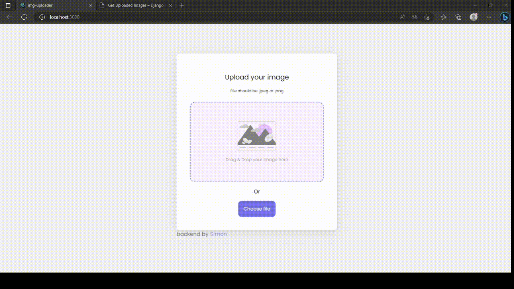

# Imgage uploader

It's a modern, user-friendly web application built with ReactJS, Material-UI, SASS, Firebase/Django REST framework. Provides users with a seamless, intuitive platform to upload and share their images. 
Live demo (version with firebase) https://earnest-beignet-69166f.netlify.app/

## Features

- Drag-and-drop image uploads
- Image file type validation and file size limit for secure and reliable uploads
- Progress bar to provide real-time updates on upload status
- Success message upon completion of image upload

## Transition to Django REST Framework

In its latest version, it incorporates Django REST Framework for backend operations, demonstrating the versatility of the application by showcasing its adaptability with different technologies.

## Installation and Setup

To run this application locally:

1. Clone the repository:
    ```
    git clone https://github.com/Simon-zps/Image-Uploader.git
    ```
2. Install dependencies:
    ```
    npm install
    ```
3. Run the application:
    ```
    npm run dev
    ```
4. Go into the backend folder and run the server:
    ```
    python manage.py runserver
    ```
5. Go to http://localhost:3000/ to view the application or http://localhost:8000/ to view the api
